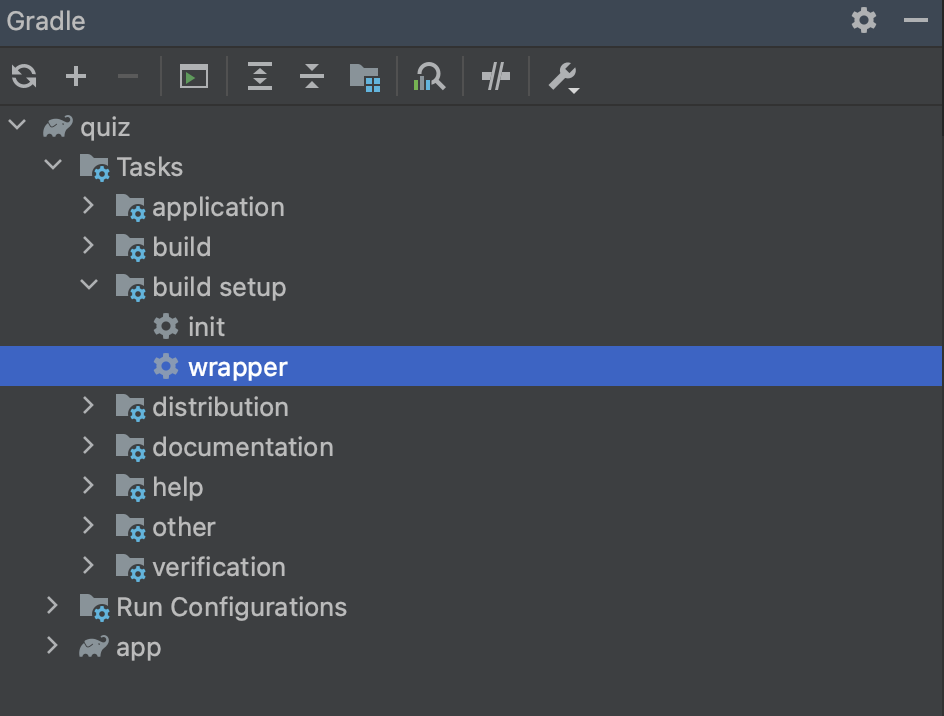
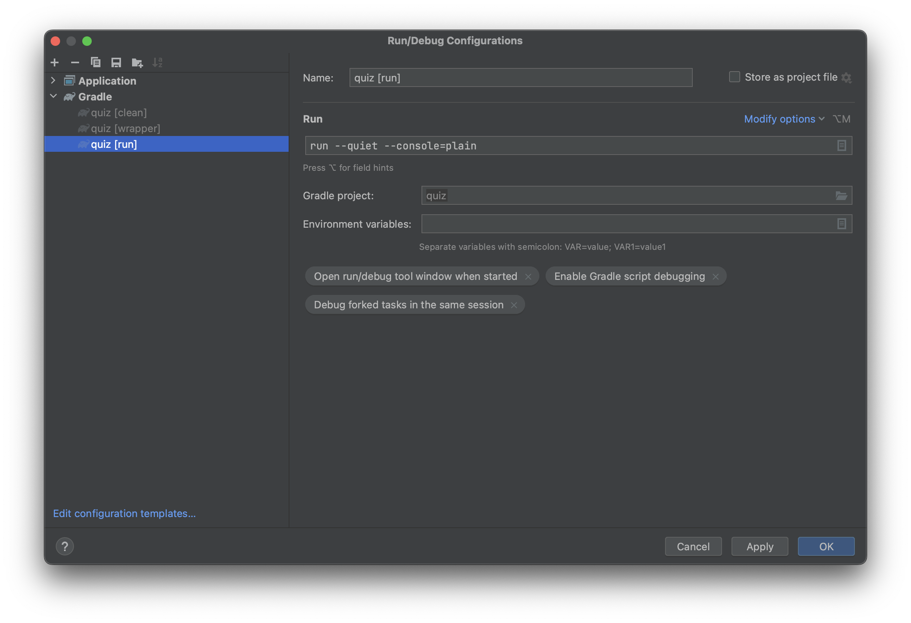

Quiz
====
Setup
-----
Open the project using IntelliJ.

Run the gradle wrapper command:

    gradle wrapper

Or run `gradle wrapper` from the Gradle pane in IntelliJ:

Run
---
Run the application from the command line:

    gradle --quiet --console=plain run

Or run `gradle run` from the Gradle pane in IntelliJ.

The `--quiet` and `--console=plain` command line options also can be set from within the IntelliJ IDE:

